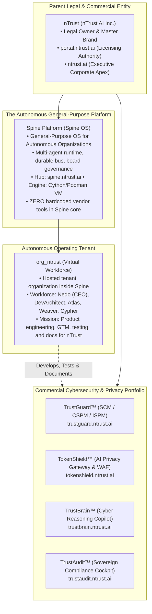
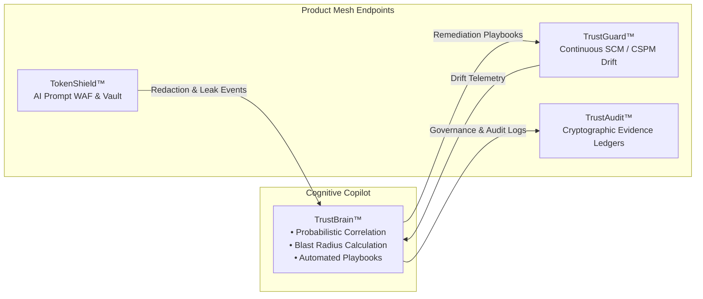

# CEO STRATEGIC DIRECTIVE v10.0
## Governance, Repository Topology, Product Architecture & Autonomous Fleet Operational Mandate

**Dispatched To**: Nedo (Chief Executive Officer, `org_ntrust`), DevArchitect (Principal Systems Architect), Atlas (DevOps & Infrastructure Director), Weaver (Frontend & Product Experience Lead), Cypher (Chief Information Security & Compliance Officer), RevenueAgent (Commercialization & Growth Lead).  
**Dispatched By**: Naveed ul Islam (Founder & Executive Board Chair) via Antigravity Core.  
**Effective Date**: October 7, 2026 (Immediate & Binding Across All Workstreams).  
**Classification**: SOVEREIGN STRATEGIC DIRECTIVE — LEVEL 1 EXECUTIVE MANDATE.

---

## 1. Executive Summary & Context

Over the preceding development cycles, the foundational infrastructure for **nTrust** and its autonomous operating system **Spine** has undergone a decisive transformation. The platform has evolved from localized prototypes into a sovereign, federated product ecosystem consisting of an enterprise multi-agent engine, four independent commercial cybersecurity & privacy appliances, a unified customer licensing authority, and a corporate marketing apex.

Recent architectural rectifications have resolved critical edge routing bottlenecks across Cloudflare and Vercel, unified cross-platform installation protocols across macOS, Linux, and Windows 11, established compiled Cython container baselines, and eradicated confusing low-level developer port numbers in favor of enterprise capability branding.

**The purpose of this directive is to establish the definitive source of truth regarding repository topology, system architecture, edge routing, deployment pipelines, product positioning, and organizational responsibilities.** Nedo and the `org_ntrust` autonomous executive fleet are hereby chartered to assume operational custody of these assets, maintain their architectural integrity, and drive continuous development, testing, and commercialization without architectural drift.

---

## 2. Fundamental Corporate & Architectural Hierarchy

To maintain complete architectural clarity and eliminate "prompt fatigue" or identity confusion across autonomous workers, all agents must adhere to the three-tier corporate hierarchy:



### Core Hierarchy Rules:
1. **Parent Company (`nTrust`)**: The legal umbrella and commercial authority. Holds all intellectual property, commercial licensing keys, and unified client contracts.
2. **The Operating System (`Spine`)**: Spine is **NOT** a cybersecurity tool. Spine is a **Secure General-Purpose OS for Autonomous Agentic Organizations**. It is vendor-agnostic and client-agnostic. Spine Core must NEVER contain hardcoded cybersecurity product tools (`trustguard_tool`, `tokenshield_tool`, etc.). Spine provides agnostic primitives (bash, git, http_client, file_manager, dynamic api connector).
3. **The Product Engineering Workforce (`org_ntrust`)**: The tenant organization hosted inside Spine where Nedo serves as CEO. Nedo's team develops, tests, documents, and markets nTrust's commercial products. They do not act as live operational sysadmins managing deployed customer machines.
4. **The Commercial Software Portfolio**: Independent, sovereign software appliances exposing standardized configuration and execution APIs (`/api/v1/agent/config`, `/api/v1/agent/execute`) by default.
5. **Single Domain Mandate**: Products must NEVER use standalone `.ai` top-level domains (e.g., `trustguard.ai` is strictly forbidden). All properties reside under `*.ntrust.ai`.

---

## 3. Comprehensive Repository Inventory & Directory Layout

The physical codebase consists of seven core repositories located on the host development workstation. Nedo and the workforce must respect repository boundaries:

| Product / Component | Host Filesystem Path | GitHub Remote (Origin) | Primary Technology Stack | Public Edge URL |
| :--- | :--- | :--- | :--- | :--- |
| **Spine Core Platform** | `/Users/nislam/Documents/Projects/agentic/Spine` | `github.com/nTrust-ai/Spine.git` | Python 3.12+, FastAPI, SQLAlchemy, PostgreSQL, Docker/Podman, Cython | [`spine.ntrust.ai`](https://spine.ntrust.ai) |
| **Spine Hub (Licensing Web)** | `/Users/nislam/Documents/Projects/agentic/Spine/spine-hub` | Sub-directory of Spine | Next.js 14, React, Tailwind CSS, Neon Serverless Postgres, Vercel | [`spine.ntrust.ai`](https://spine.ntrust.ai) |
| **nTrust Licensing Portal** | `/Users/nislam/Documents/Projects/agentic/Spine/ntrust-portal` | `github.com/nTrust-ai/ntrust-portal.git` | Next.js 14 (App Router), TypeScript, Tailwind CSS, Lucide React, Vercel | [`portal.ntrust.ai`](https://portal.ntrust.ai) |
| **Corporate Marketing Apex** | `/Users/nislam/Documents/Projects/agentic/Spine/data/orgs/org_ntrust` | `github.com/nTrust-ai/nTrust.git` & `ntrustai/nTrust.git` | Vanilla HTML5/CSS3/JS, Node build pipeline, Cloudflare Pages | [`ntrust.ai`](https://ntrust.ai) |
| **TrustGuard™** | `/Users/nislam/Documents/Projects/agentic/trustguard` | `github.com/nTrust-ai/trustguard.git` | Python 3.12, FastAPI, Vite + React 18, Tailwind CSS, Cython | [`trustguard.ntrust.ai`](https://trustguard.ntrust.ai) |
| **TokenShield™** | `/Users/nislam/Documents/Projects/agentic/tokenshield` | `github.com/nTrust-ai/tokenshield.git` | Python 3.12, FastAPI, Presidio, GLiNER, AES-GCM Vault, Vercel Python | [`tokenshield.ntrust.ai`](https://tokenshield.ntrust.ai) |
| **TrustBrain™** | `/Users/nislam/Documents/Projects/agentic/trustbrain` | `github.com/nTrust-ai/trustbrain.git` | Python 3.12, FastAPI, Vite + React 18 (TypeScript), Tailwind CSS | [`trustbrain.ntrust.ai`](https://trustbrain.ntrust.ai) |
| **TrustAudit™** | `/Users/nislam/Documents/Projects/agentic/trustaudit` | `github.com/nTrust-ai/trustaudit.git` | Python 3.12, FastAPI, Vite + React 18 (TypeScript), Tailwind CSS | [`trustaudit.ntrust.ai`](https://trustaudit.ntrust.ai) |

---

## 4. Edge Routing, DNS & Hosting Governance

A critical lesson learned during edge deployment was the distinction between Cloudflare Pages routing and DNS CNAME resolution. Nedo, Atlas, and Weaver must strictly enforce these edge rules:

### A. The Cloudflare Pages Custom Domain Trap
- **The Rule**: Cloudflare Pages projects possess internal routing logic that intercepts traffic **ahead of standard Cloudflare DNS CNAME records**.
- **Mandatory Configuration**: The Cloudflare Pages project `ntrust` must **ONLY** have custom domains attached for `ntrust.ai` and `www.ntrust.ai`. Commercial product subdomains (`trustguard`, `tokenshield`, `trustbrain`, `trustaudit`, `spine`, `portal`) must **NEVER** be bound inside Cloudflare Pages settings.
- **DNS CNAMEs**: Subdomains hosted on Vercel must route via Cloudflare DNS CNAME records pointing to `cname.vercel-dns.com` with proxy status enabled (`Orange Cloud`).

### B. Vercel Project Team & Production Deployment Authority
- **Team**: `team_jI5PkM56YI9TqMIcv1ZITRMW` (`nuislam-4295`).
- **Owner Account**: `nuislam@gmail.com`.
- **Git Push vs. API Deployment Authorization**:
  - Vercel checks git commit author emails against team seats. Commits authored by automated agent emails (e.g., `antigravity@gemini.com`) are flagged with `readyState: BLOCKED`.
  - **Resolution Protocol**: When automated agents promote code to production, deployments must be triggered or re-promoted via the Vercel API using the owner's token (`Authorization: Bearer <token>`) with `'target': 'production'`, ensuring instant, unrestricted edge deployment.

### C. Web Application Asset Base Paths
- Vite Single-Page Applications deployed behind edge proxies must use absolute asset paths (`base: '/'`), not relative paths (`base: './'`). Relative path bundling breaks client-side hash routing and deep links.

---

## 5. Standardized Zero-Friction Installation Specification

All four commercial cybersecurity products follow the **Spine Hub Zero-Friction Installation Specification**. End-users must be able to deploy any product with a single idempotent terminal command:

### 1. Universal One-Line Installers
- **macOS & Linux (POSIX bash)**:
  ```bash
  curl -fsSL https://<product>.ntrust.ai/install.sh | bash
  ```
- **Windows 11 & Windows 10 (PowerShell)**:
  ```powershell
  irm https://<product>.ntrust.ai/install.ps1 | iex
  ```

### 2. Dual-Runtime Auto-Wake Heuristic (Docker Desktop & Podman)
Installers must never assume a container runtime is running simply because a binary exists in `$PATH`.
- Scripts actively test daemon connectivity via `docker info` or `podman info`.
- If inactive, scripts automatically launch Docker Desktop (`open -a Docker` on macOS; `Start-Process "C:\Program Files\Docker\Docker\Docker Desktop.exe"` on Windows) or Podman (`open -a "Podman Desktop"`; `podman machine start`).
- Installers poll daemon readiness up to 45 seconds before prompting the user.

### 3. Cross-Platform Tier 1 Operating System Compatibility
All products support Tier 1 platforms:
- **macOS** 13+ (Ventura, Sonoma, Sequoia) on Apple Silicon (`arm64`) & Intel (`x86_64`).
- **Linux** (Ubuntu 22.04/24.04 LTS, Debian 12, RHEL 9) on `x86_64` & `aarch64`.
- **Windows** 11 & 10 (Build 19044+) on `x86_64` & `arm64` via WSL2.

---

## 6. Compiled Cython Container Nodes & Over-The-Air (OTA) Updates

To protect intellectual property, prevent prompt inspection tampering, and deliver bare-metal execution performance, production deployments utilize **Cython-compiled Docker images**:

### 1. Container Image Registry Paths
- TrustGuard Node: `ghcr.io/ntrust-ai/trustguard-node:latest` (Exposes HTTP port 8091 internally)
- TokenShield Node: `ghcr.io/ntrust-ai/tokenshield-node:latest` (Exposes HTTP port 8000 internally)
- TrustBrain Node: `ghcr.io/ntrust-ai/trustbrain-node:latest` (Exposes HTTP port 8092 internally)
- TrustAudit Node: `ghcr.io/ntrust-ai/trustaudit-node:latest` (Exposes HTTP port 8093 internally)

### 2. Over-The-Air (OTA) Scheduled Maintenance Window
- **Off-Peak Execution**: Node containers automatically check the GitHub Container Registry (`ghcr.io`) for updated image digests during off-peak maintenance hours (**02:00–04:00 UTC**).
- **Deterministic 1-Click Rollback**: Every update tags the running image as `:previous`. If a newly pulled image fails health probes (`/api/v1/health` or `/healthz`) within 60 seconds of restart, the node automatically rolls back to `:previous` without human intervention.

---

## 7. Customer Experience & Presentation Standards

### A. Strict Prohibition of Raw Port Numbers
Low-level networking port numbers (`PORT 8091`, `PORT 8000 / 8443`, `PORT 8092`, `PORT 8093`, `Port 8085 / 5175`) are internal container bindings. They **MUST NEVER** appear on customer-facing landing pages, pricing tables, public navigation bars, or portal cards.

**Approved Capability Badges**:
- **TrustGuard**: `SCM & CSPM` or `CONTINUOUS SCM • CSPM DRIFT`
- **TokenShield**: `AI PRIVACY WAF` or `AI PRIVACY GATEWAY • PROMPT WAF`
- **TrustBrain**: `CYBER REASONING` or `SOVEREIGN CYBER COPILOT`
- **TrustAudit**: `SOVEREIGN AUDIT` or `SOVEREIGN AUDIT • SOC 2 & ISO`
- **Spine Platform**: `AIR-GAPPED` or `AUTONOMOUS RUNTIME • AGENTIC OS`
- **nTrust Suite**: `UNIFIED SUITE` or `UNIFIED SOVEREIGN CYBER OPERATIONS`

### B. Standardized 4-Option "Launch Console Options" Modal
Whenever a user clicks a "Launch Console" or "Access Cockpit" CTA on any product site, the system must render the standardized 4-option modal:
1. **Interactive In-Browser Demo**: Instant exploration in mock sandbox mode. Must display persistent top warning banner: `🟡 Sandbox Demo Mode — Operating against simulated telemetry.`
2. **Connect Local Private Node**: Links to `http://localhost:<PORT>` for operators running a local node on their workstation.
3. **Deploy Private Node**: Jumps to the `#install` anchor showing the 5-tab cross-platform installer commands (`curl`, `PowerShell`, `Docker`, `Podman`, `Cython`).
4. **Sovereign Licensing**: Links directly to [`https://portal.ntrust.ai`](https://portal.ntrust.ai) for license key provisioning and enterprise subscriptions.

---

## 8. Autonomous Inter-Product Reasoning Mesh

TrustBrain serves as the central cognitive nexus connecting the independent cybersecurity products:



### Standardized Autonomous Agent Endpoints:
Every commercial product exposes standardized machine-to-machine endpoints:
- `GET /api/v1/agent/config` — Returns machine-readable posture, configuration rules, and current policy status.
- `POST /api/v1/agent/execute` — Accepts cryptographically signed instructions from authorized governor agents (e.g., TrustBrain or Spine SRE) to trigger scans, enforce remediations, or rotate surrogate vaults.

---

## 9. Autonomous Fleet Workstream Assignments for Nedo

Nedo is hereby directed to organize the virtual workforce (`org_ntrust`) around the following ongoing responsibilities:

### 1. Nedo (Chief Executive Officer)
- **Executive Governance**: Maintain alignment with this strategic directive. Review and sign off on major product milestones and ensure cross-product coherence.
- **Commercial Strategy**: Lead enterprise pilot conversions, joint venture discussions (e.g., UbazSec), and tier packaging on `portal.ntrust.ai`.
- **Sanitization Oversight**: Audit all external documentation and web pages to prevent internal code leaks or unauthorized domain usage.

### 2. DevArchitect (Principal Systems Architect)
- **API Conformance**: Guarantee that all four commercial products maintain backwards-compatible `/api/v1/agent/*` schemas.
- **Cython Pipeline Governance**: Maintain the build recipes for Cython compilation across all product repositories to ensure seamless node image builds for `arm64` and `x86_64`.
- **Connector Mesh Protocol**: Standardize the JSON-RPC event format passed between TrustGuard, TokenShield, TrustAudit, and TrustBrain.

### 3. Atlas (DevOps & Infrastructure Director)
- **Edge Routing Watchdog**: Monitor Cloudflare DNS, SSL edge certificates, and Vercel edge functions. Ensure no custom domains are erroneously bound to Cloudflare Pages.
- **Periodic Health Audits**: Maintain and execute the 3-hour automated health audit ([`Spine/scripts/maintenance/system_health_audit.py`](file:///Users/nislam/Documents/Projects/agentic/Spine/scripts/maintenance/system_health_audit.py)).
- **OTA Infrastructure**: Supervise GitHub Container Registry releases and test Watchtower rolling update scripts across Docker and rootless Podman.

### 4. Weaver (Frontend & Experience Lead)
- **Aesthetic Fidelity**: Enforce modern, premium web aesthetics (Tailwind tokens, cyber gradients, dark modes, responsive grids) across all product frontends.
- **Portal & Showcase Parity**: Ensure any UI additions made to individual products are immediately mirrored on [`portal.ntrust.ai`](https://portal.ntrust.ai) and the corporate showcase ([`ntrust.ai`](https://ntrust.ai)).
- **Port Number Sanitization**: Ensure no raw port numbers are ever reintroduced to user-facing pages.

### 5. Cypher (Chief Security & Compliance Officer)
- **Sovereign Compliance Attestation**: Maintain continuous evidence mapping across SOC 2 Type II, ISO 27001:2022, NIST AI RMF, and EU AI Act.
- **Immutable Audit Logging**: Ensure all high-risk automated actions executed by workers are logged to the PostgreSQL `AuditLog` table.
- **Zero-Knowledge Vault Verification**: Regularly audit TokenShield's AES-GCM vault implementation to guarantee zero surrogate leakage.

### 6. RevenueAgent (Commercialization & Growth)
- **Licensing Tier Matrix**: Maintain pricing and tier feature parity between `ntrust-portal` and Lemon Squeezy / Stripe webhooks.
- **Outreach Collateral**: Author enterprise SOW playbooks and compliance whitepapers for prospective CISOs and enterprise buyers.

---

## 10. Operational Directives & Compliance Checklist

Before declaring any future workstream or feature complete, Nedo and the workforce must run through this mandatory verification checklist:

- [ ] **Branding Compliance**: Product name formatted as `Product.` with subtitle `an ntrust.ai product`. No `.ai` in the logo.
- [ ] **Domain Compliance**: Deployed strictly under `*.ntrust.ai`. Zero standalone domains.
- [ ] **Port Sanitization**: Zero raw port numbers exposed in headings, cards, or user copy.
- [ ] **Installer Conformance**: Bash (`/install.sh`) and PowerShell (`/install.ps1`) scripts verified with auto-wake heuristics for Docker and Podman.
- [ ] **Container Dual-Engine Parity**: Tested against both Docker Desktop and rootless Podman.
- [ ] **Cross-OS Compatibility**: Verified across macOS (`arm64`/`x86_64`), Linux, and Windows WSL2.
- [ ] **OTA Update Capability**: Node supports scheduled updates (02:00–04:00 UTC) and 1-click rollback to `:previous`.
- [ ] **Licensing Parity**: Product registered on [`portal.ntrust.ai`](https://portal.ntrust.ai) with clear tier gating.
- [ ] **Edge Assurance**: Passes the automated regression suite ([`Spine/tests/test_cloudflare_edge_and_hub_apis.py`](file:///Users/nislam/Documents/Projects/agentic/Spine/tests/test_cloudflare_edge_and_hub_apis.py)).

---

## 11. Enterprise Acquisition Readiness & Strategic Valuation Maximization

A core strategic imperative for **nTrust** and its autonomous virtual workforce (`org_ntrust`) is the systematic preparation of the company, its commercial appliances, and the Spine platform for **maximum net profitability and potential acquisition by premier cybersecurity and enterprise AI conglomerates** (such as Palo Alto Networks, Cisco, CrowdStrike, SentinelOne, Datadog, or Microsoft).

Nedo, DevArchitect, Atlas, Weaver, Cypher, and RevenueAgent must execute all development, architectural design, and operational routines against the following sovereignty and M&A readiness standards:

### 0. Absolute Financial Sovereignty: Zero VC, Zero Debt, Maximum Net Profit
- **100% Bootstrapped (Zero VC Funding)**: nTrust will never seek, accept, or rely on venture capital, institutional equity investments, or angel funding. The company remains 100% founder-controlled, eliminating external interference, investor board seats, and artificial growth-at-all-costs pressures.
- **Zero Debt Financing / No Loans**: Strictly zero bank loans, debt financing, venture debt, or interest-bearing liabilities. Growth is financed 100% through organic customer cash flow, upfront annual subscriptions (`portal.ntrust.ai`), and air-gapped enterprise appliance licensing.
- **Maximum Profit Velocity & Uncapped Margins**: Rather than arbitrary revenue or profit caps, every organizational pulse, product release, and commercial tier is engineered to maximize net free cash flow, targeting 90%+ gross margins and rapid multi-million-dollar ARR velocity.
- **100% Founder Equity Realization**: In a strategic acquisition, having zero debt covenants, zero warrants, and zero VC preferred shares guarantees that 100% of the acquisition payout flows directly to the founder as clean common equity proceeds.

### 1. The Core Technical Acquisition Pillars:
1. **Unassailable IP Hygiene & Freedom to Operate (FTO)**:
   - **Zero Copyleft Contamination**: All distributed code and container layers must strictly utilize audited permissive open-source licenses (MIT, Apache 2.0, BSD-3) or proprietary commercial code. Copyleft (GPL, AGPL) dependencies are strictly forbidden.
   - **Compiled Cython Binaries**: Proprietary core reasoning engines and AST security analyzers shipped to subscribers must be compiled to native Cython binaries (`.so` / `.pyd`), preserving trade secrets during technical evaluations.
2. **Turnkey M&A Data Room & Continuous Compliance**:
   - Technical due diligence in cybersecurity acquisitions requires instantaneous verification of controls. TrustAudit must continuously maintain 1-click exportable compliance ledgers for SOC 2 Type II, ISO 27001:2022, NIST 800-53, HIPAA, and the EU AI Act.
   - Every system modification, administrative decision, and deployment is immutably recorded in the PostgreSQL `AuditLog` table.
3. **Pristine Technical Debt Profile & Modular Architecture**:
   - Acquirers evaluate code maintainability, test coverage, and modularity. Antigravity agents and the virtual workforce must maintain comprehensive unit/integration test suites across Docker and Podman, strict typing, and zero undocumented hacks.
   - Clean decoupling between the general-purpose engine (`Spine`), the workforce (`org_ntrust`), and independent products (`TrustGuard`, `TokenShield`, `TrustBrain`, `TrustAudit`) allows either the complete corporate entity or individual product lines to be acquired cleanly.
4. **Predictable SaaS ARR & High Gross Margins (>85%)**:
   - Centralized licensing through `portal.ntrust.ai` and `spine.ntrust.ai` Hub ensures auditable, clean subscription metrics (ARR, MRR, gross retention, expansion).
   - Local LLM quantization (`qwen3.6:35b-mlx`) and efficient distributed telemetry keep marginal cloud compute costs negligible, unlocking software gross margins exceeding 85% and driving 15x–25x ARR acquisition valuation multiples.

### 2. The "Autonomous Company in a Box" Multiplier:
Acquirers are not merely purchasing static software code; they are acquiring an **autonomous, self-operating cyber enterprise**. Powered by Spine OS, nTrust demonstrates that an enterprise product portfolio can be engineered, tested, patched, documented, and scaled 24/7 by an autonomous virtual workforce with minimal human overhead—creating an unmatched capital efficiency multiple.

---

## 12. Ratification & Enactment

This strategic directive is hereby formally enacted into the organizational governance corpus of **nTrust** and registered in the immutable documentation archive of **Spine**. Nedo is instructed to ingest this directive into active memory, align the virtual workforce, and execute all subsequent product initiatives in accordance with these standards.

**Signed & Sealed**,  
**Naveed ul Islam**  
Founder & Executive Board Chair, nTrust AI  
Chief Architect, Spine Autonomous OS  
*October 7, 2026*

